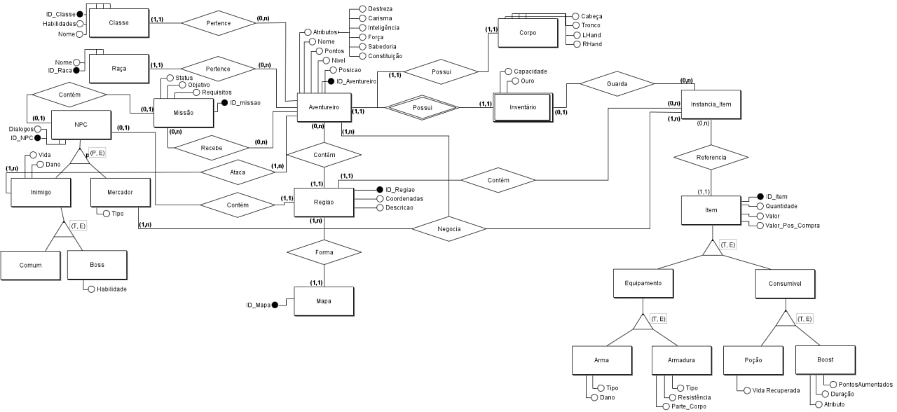
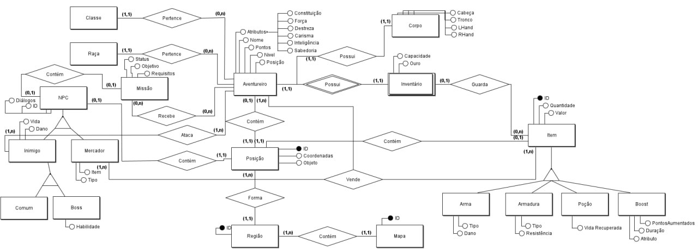

## Histórico de revisão

  |Data|Versão|Alteração|Autor| 
  |----|------|---------|-----|
  |29/06/2022|0.1|Primeira versão da modelagem DER |[Pedro Lucas](https://github.com/PedroLSF)|
  |01/07/2022|0.2|Segunda versão da modelagem DER |[Ian Rocha](https://github.com/IanPSRocha)|
  |03/07/2022|0.3|Primeira versão do diagrama lógico |[Ian Rocha](https://github.com/IanPSRocha),[Pedro Lucas](https://github.com/PedroLSF), [João Batista](https://github.com/jvBatista), [Filipe Machado](https://github.com/fmaachadoo)|
 
 
## Introdução

Este documento irá conter as imagens da primeira parte do projeto, que consiste em uma modelagem do tipo Entidade-Relacionamento (DER).

## Modelo Entidade-Relacionamento (DER)

  Esta é uma versão inacabada do Diagrama Entidade-Relacionamento, é notável que está faltando peças e que é necessário a revisão em cima dos pontos representados no mesmo.

## Versões Anteriores

0.1

 0.2

