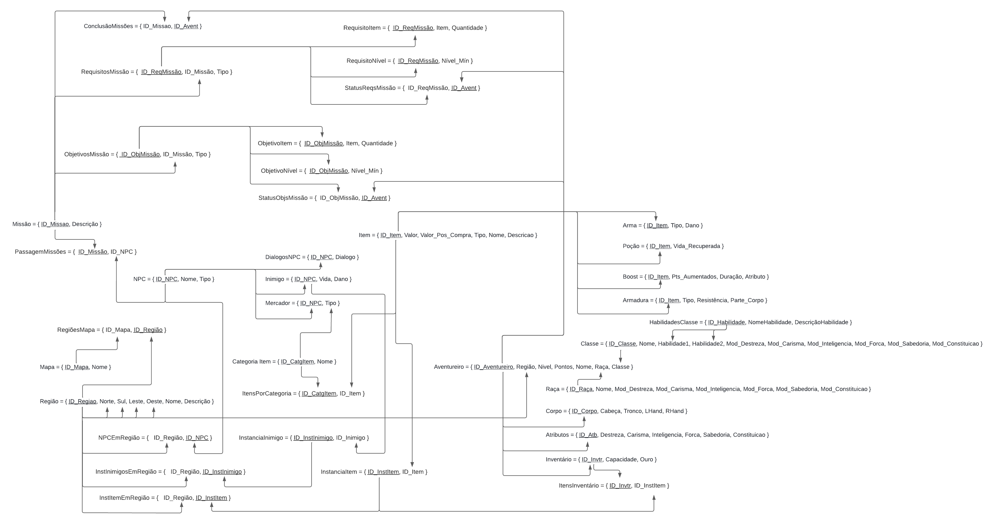
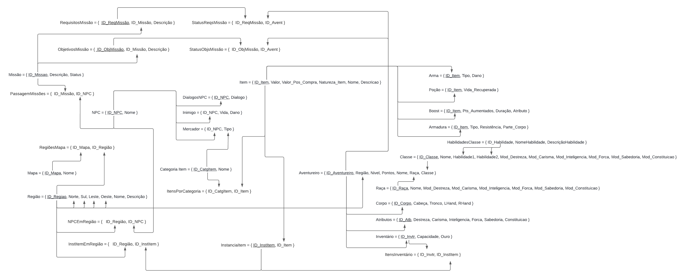
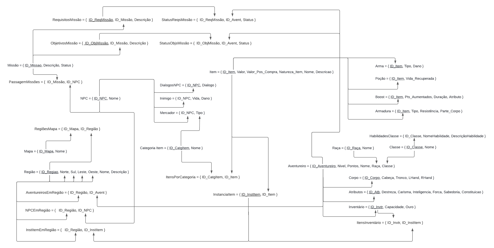
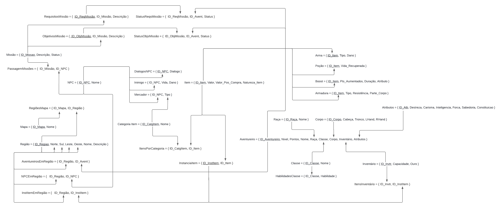

## Histórico de revisão

  |Data|Versão|Alteração|Autor| 
  |----|------|---------|-----|
  |28/07/2022|0.1|Primeira Versão do MREL Normalizado|[João Victor](https://github.com/jvBatista)|
  |15/08/2022|0.2|Atualização Pós Entrega 2|[João Victor](https://github.com/jvBatista)|
  |05/09/2022|0.3|Adição de Novas Entidades|[João Victor](https://github.com/jvBatista)|
  
 
## Introdução

Este documento irá conter as imagens das atualizações do Modelo Relacional no qual serão aplicadas as regras de normalização da 1º, 2º e 3º Forma Normal.

# Modelo Relacional Normalizado

  Esta é a versão atual do Modelo Relacional Normalizado
  
  P.S.: Pode existir alguma alteração ao longo do desenvolvimento, visto que pode existir algo novo no jogo ou alguma alteração deve ser feita.
  

## Versões Anteriores

  
0.3

  

  
0.2

  

  
0.1

    

